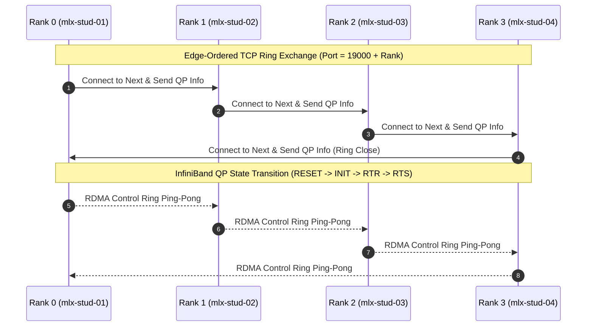
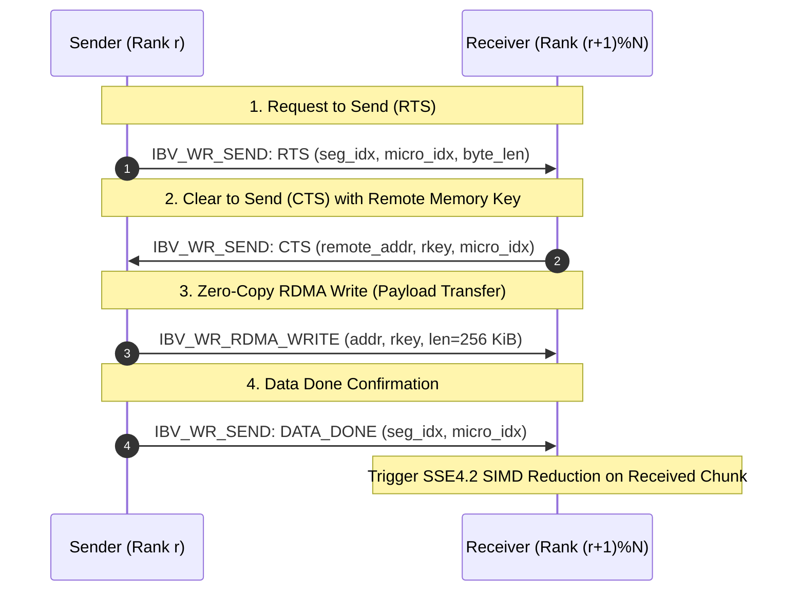
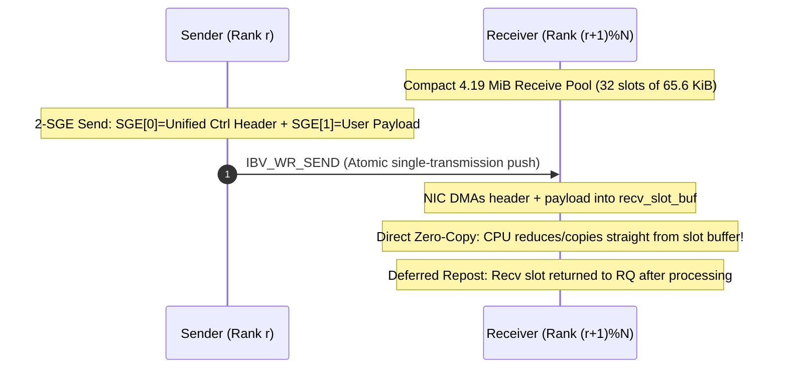

# RDMA Ring Collectives — Low-Latency Communication Library

High-performance, single-threaded RDMA collective communication library implementing **Reduce-Scatter**, **All-Gather**, and **All-Reduce** over InfiniBand Reliable Connected (RC) Queue Pairs using the `libibverbs` API.

Designed and tuned on a 4-node InfiniBand cluster (`mlx-stud-01..04`), achieving **22.51–22.62 Gbps** peak effective bandwidth with automatic Eager/Rendezvous switching, direct zero-copy eager CPU receive, 4.19 MiB compact receive pools (75% memory footprint reduction), and pipelined zero-copy RDMA execution.

---

## 1. Architecture Overview

```
+-------------------------------------------------------------------------------+
|                             PUBLIC API LAYER                                  |
|   connect_process_group()   pg_reduce_scatter()   pg_all_gather()             |
|   pg_all_reduce()           pg_close()                                        |
+---------------------------------------+---------------------------------------+
                                        |
+---------------------------------------v---------------------------------------+
|                    COLLECTIVE ORCHESTRATION ENGINE                            |
|   - MPI Remainder Slicing ((Q+1)/Q)       - 3-Phase Distributed Ring Barrier  |
|   - Ring Permutation Step Math            - Safe Workbuf / Zero-Copy Staging  |
+-------------------+---------------------------------------+-------------------+
                    |                                       |
+-------------------v-------------------+   +---------------v-------------------+
|     PROGRESS ENGINE (SEAM #1)         |   |    STEP TRANSFER (SEAM #2)        |
| - wr_id Bit-Packing & CQ Polling      |   | - Eager 2-SGE Scatter-Gather SEND |
| - Unexpected Message Pending Queue    |   | - 4-Way Rendezvous RDMA Write     |
| - Auto Receive Slot Replenishment     |   | - Pipelined Window Flow Control   |
+-------------------+-------------------+   +---------------+-------------------+
                    |                                       |
+-------------------v---------------------------------------v-------------------+
|               SSE4.2 128-BIT VECTOR REDUCTION (4x UNROLLED)                   |
|   12 combinations: {PG_INT, PG_FLOAT, PG_DOUBLE} x {SUM, MIN, MAX, PROD}       |
+-------------------------------------------------------------------------------+
|                       HARDWARE & VERBS TRANSPORT                              |
|   - 2 RC QPs (qp_to_next, qp_from_prev)   - Shared Completion Queue (CQ)     |
|   - Lazy MR Registration Cache            - Inline Payload Probing            |
+-------------------------------------------------------------------------------+
```

### Core Design Principles
1. **Zero-Copy Memory Placement**: All-Gather writes directly into the caller's registered `recvbuf` via RDMA Write.
2. **Compute-Communication Overlap**: Adaptive 64 KiB / 256 KiB micro-chunks pipeline network transmission with 128-bit SSE4.2 SIMD vector reduction.
3. **Adaptive Protocol Switching**: Automatically switches between Eager Send/Recv ($\le 64\text{ KiB}$ segment / $\le 256\text{ KiB}$ tensor) for low latency and Pipelined Rendezvous ($> 64\text{ KiB}$) for line-rate throughput.
4. **Deadlock-Free Bootstrap**: Edge-ordered TCP connection initialization ensures deterministic ring setup across arbitrary rank counts.

---

## 2. Interactive Protocol & Workflow Diagrams

### 2.1 Ring Topology & Edge-Ordered TCP Bootstrap
Ranks establish TCP sockets sequentially to exchange InfiniBand QP parameters (`QPN`, `PSN`, `LID`) without circular deadlocks:



---

### 2.2 Four-Way Rendezvous Control Handshake
Used for large transfers ($> 64\text{ KiB}$ segment) to grant remote write permissions directly into registered destination memory:



---

### 2.3 Eager 2-SGE Scatter-Gather & Direct Zero-Copy CPU Receive
Used for small/medium transfers ($\le 64\text{ KiB}$ segment / $\le 256\text{ KiB}$ tensor) to eliminate the 2-RTT RTS/CTS handshake and push payload directly into pre-posted receive buffers with direct zero-copy CPU consumption:



---

### 2.4 Pipelined Micro-Chunk Execution Timeline
Demonstrating concurrent communication and computation on a 4-node cluster:

```mermaid
gantt
    title Pipelined Reduce-Scatter Step (256 KiB Micro-Chunks)
    dateFormat X
    axisFormat %s

    section Rank r (Sender)
    RDMA Write Chunk 0   :active, s0, 0, 13
    RDMA Write Chunk 1   :active, s1, 13, 26
    RDMA Write Chunk 2   :active, s2, 26, 39
    RDMA Write Chunk 3   :active, s3, 39, 52

    section Rank r+1 (Receiver)
    Recv Chunk 0         :done, r0, 0, 13
    SIMD Reduce Chunk 0  :crit, c0, 13, 17
    Recv Chunk 1         :done, r1, 13, 26
    SIMD Reduce Chunk 1  :crit, c1, 26, 30
    Recv Chunk 2         :done, r2, 26, 39
    SIMD Reduce Chunk 2  :crit, c2, 39, 43
    Recv Chunk 3         :done, r3, 39, 52
    SIMD Reduce Chunk 3  :crit, c3, 52, 56
```



---

## 3. Mathematical Derivations

### 3.1 Remainder Partitioning for Arbitrary Buffer Sizes
When total element count $C$ is not divisible by rank count $N$:
- Base segment count: $Q = \lfloor C / N \rfloor$
- Remainder count: $R = C \bmod N$

Each rank $i \in [0, N-1]$ owns a deterministic segment slice:

$$\text{count}(i) = \begin{cases} Q + 1 & \text{if } i < R \\ Q & \text{if } i \ge R \end{cases}$$

$$\text{offset}(i) = \begin{cases} i \times (Q + 1) & \text{if } i < R \\ R \times (Q + 1) + (i - R) \times Q & \text{if } i \ge R \end{cases}$$

$$\sum_{i=0}^{N-1} \text{count}(i) = R(Q + 1) + (N - R)Q = NQ + R = C$$

This guarantees 100% data coverage with zero padding or memory out-of-bounds errors.

### 3.2 Reduce-Scatter Segment Permutation
In an $N$-rank ring, Reduce-Scatter executes $N-1$ steps ($k \in [0, N-2]$).
At step $k$:
- Outbound segment transmitted to `next_rank`:
  $$s_{\text{out}}(k) = (\text{rank} - k - 1 + N) \bmod N$$
- Inbound segment received from `prev_rank`:
  $$s_{\text{in}}(k) = (\text{rank} - k - 2 + N) \bmod N$$

**Proof of Invariant**: After step $k$, rank $r$ holds the partial reduction of segment $s_{\text{in}}(k)$ accumulated across $k+2$ ranks. After $N-1$ steps, each rank $r$ holds the globally reduced slice for segment $r$.

### 3.3 All-Gather Segment Permutation
All-Gather executes $N-1$ steps ($k \in [0, N-2]$).
At step $k$:
- Outbound segment transmitted to `next_rank`:
  $$s_{\text{out}}(k) = (\text{rank} - k + N) \bmod N$$
- Inbound segment received from `prev_rank`:
  $$s_{\text{in}}(k) = (\text{rank} - k - 1 + N) \bmod N$$

Data is written directly into `recvbuf + offset(s_in)` with zero memory copies. After $N-1$ steps, all ranks hold the entire contiguous result.

---

## 4. Empirical Performance Highlights

*Summary benchmarks on 4-node physical InfiniBand cluster (`mlx-stud-01..04`)*:

| Size | Auto Latency (Before) | Auto Latency (Optimized) | Latency Delta | Effective Bandwidth | Optimal Protocol Mode |
| :--- | :---: | :---: | :---: | :---: | :--- |
| **64 B** | $43.13\,\mu\text{s}$ | **$41.88\,\mu\text{s}$** | **-2.9%** | 0.02 Gbps | **Eager (Direct Zero-Copy)** |
| **256 B** | $44.05\,\mu\text{s}$ | **$42.77\,\mu\text{s}$** | **-2.9%** | 0.07 Gbps | **Eager (Direct Zero-Copy)** |
| **1 KiB** | $45.13\,\mu\text{s}$ | **$43.54\,\mu\text{s}$** | **-3.5%** | 0.28 Gbps | **Eager (Direct Zero-Copy)** |
| **8 KiB** | $54.32\,\mu\text{s}$ | **$51.93\,\mu\text{s}$** | **-4.4%** | 1.89 Gbps | **Eager (Direct Zero-Copy)** |
| **16 KiB** | $62.05\,\mu\text{s}$ | **$59.64\,\mu\text{s}$** | **-3.9%** | 3.30 Gbps | **Eager (Direct Zero-Copy)** |
| **32 KiB** | $72.64\,\mu\text{s}$ | **$67.18\,\mu\text{s}$** | **-7.5%** | **5.85 Gbps** | **Eager (Direct Zero-Copy)** |
| **64 KiB** | $94.71\,\mu\text{s}$ | **$89.95\,\mu\text{s}$** | **-5.0%** | **8.74 Gbps** | **Eager (Direct Zero-Copy)** |
| **128 KiB** | $144.19\,\mu\text{s}$ | **$130.89\,\mu\text{s}$** | **-9.2%** | **12.02 Gbps** | **Eager (Direct Zero-Copy)** |
| **256 KiB** | $239.76\,\mu\text{s}$ | **$214.56\,\mu\text{s}$** | **-10.5%** | **14.66 Gbps** | **Eager (Direct Zero-Copy)** |
| **1 MiB** | $823.54\,\mu\text{s}$ | **$827.68\,\mu\text{s}$** | +0.5% | **15.20 Gbps** | **Rendezvous ($1.1\times$ faster than eager)** |
| **64 MiB** | $37.45\,\text{ms}$ | **$36.68\,\text{ms}$** | -2.1% | **21.96 Gbps** | **Rendezvous (Adaptive 64K Chunks)** |
| **1 GiB** | $576.07\,\text{ms}$ | **$569.73\,\text{ms}$** | **-1.1%** | **22.62 Gbps** | **Rendezvous (Peak: 22.62 Gbps)** |

> [!TIP]
> For the complete dataset, hyperparameter sensitivity sweeps (chunk size, window depth, batching, SIMD vs scalar), and the **Tested vs. Not-Tested Boundary Matrix**, refer to the full [Empirical Protocol Evaluation Report](file:///c:/Users/marmo/ateret/ex3_network/docs/empirical_protocol_report.md).

---

## 5. Repository Structure & Architectural Modules

```
.
├── CONTEXT.md                    # Ubiquitous language, domain concepts & architectural invariants
├── Makefile                      # Build system with mode flags (auto & inplace defaults)
├── README.md                     # Top-level architectural documentation (this document)
├── assignment.txt                # Exercise specification and constraints
├── compare_protocols.py          # Automated Eager vs Rendezvous comparative runner
├── run_all_benchmarks.py         # Full automated benchmark & sensitivity sweep runner
├── run_cluster_test.sh           # Multi-node cluster execution script
│
├── pg.h                          # Public C API and CLI structures
├── pg_internal.h                 # Internal wire protocols, SIMD dispatch & constants
├── pg.c                          # Core implementation organized in modular sections:
│   ├── MODULE 1: TCP Bootstrap & CLI Topology
│   ├── MODULE 2: Verbs Hardware & QP Lifecycle
│   ├── MODULE 3: Memory Registration & Staging Cache
│   ├── MODULE 5: SSE4.2 Vector Reduction Compute Kernels
│   ├── MODULE 4: Progress Engine & CQ Dispatch (Private Progress Seam)
│   ├── Group Lifecycle & Distributed Ring Barrier (ADR-0007)
│   └── MODULE 6: Ring Step Transfer & Collectives Orchestration

│
├── main_test.c                   # Validation & benchmark test harness
│
├── research/
│   ├── R1-verbs-patterns.md          # Verbs API patterns for RC Queue Pairs in ring collectives
│   └── R2-optimization-attempts-and-findings.md # Detailed post-mortems of successes & failures
│
└── docs/
    ├── empirical_protocol_report.md  # Detailed benchmark analysis and empirical boundary matrix
    └── adr/                          # Architectural Decision Records (0001 - 0007)
        ├── 0001-wr-id-progress-engine.md
        ├── 0002-mr-buffer-lifecycle.md
        ├── 0003-eager-threshold-and-adaptive-selection.md
        ├── 0004-simd-vectorization-and-wr-batching.md
        ├── 0005-mpi-remainder-and-ring-step-permutation.md
        ├── 0006-pipelined-windowing-and-selective-signaling.md
        └── 0007-three-phase-distributed-barrier.md
```

---

## 6. Build & Execution Guide

### 6.1 Build Configurations
The library compiles cleanly with `gcc` under `-Wall -Wextra -Werror -O3 -std=gnu11 -msse4.2` and defaults to the optimal performance configuration (`MODE=auto`, `WORKBUFFER=inplace`, `PG_PIPELINE_CHUNK=256 KiB`, `PG_RDMA_WINDOW=32`):

```bash
# Default Build (Auto Mode + Inplace Workbuffer + 256 KiB Pipelining)
make

# Compile with Specific Protocol Mode
make MODE=auto       # Dynamic Eager (<=64 KiB segment / <=256 KiB tensor) and Rendezvous (>64 KiB) [Default]
make MODE=rendezvous # Pure Rendezvous RDMA Write
make MODE=eager      # Pure Eager Send/Recv

# Compile with Safe Work Buffer (Preserves sendbuf without mutation)
make WORKBUFFER=safe
```

### 6.2 Multi-Node Cluster Execution
Run on the physical InfiniBand cluster (`mlx-stud-01..04`):

```bash
# Run 4-node collective test
bash run_cluster_test.sh 4

# Run 2-node collective test
bash run_cluster_test.sh 2

# Run automated Eager vs Rendezvous comparative sweep
python3 compare_protocols.py --ranks 4

# Run full 23-size benchmark & sensitivity suite
python3 run_all_benchmarks.py
```
